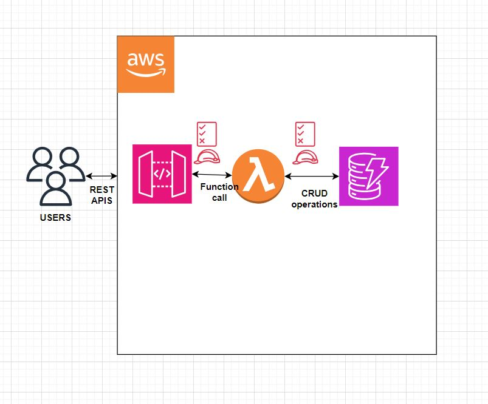
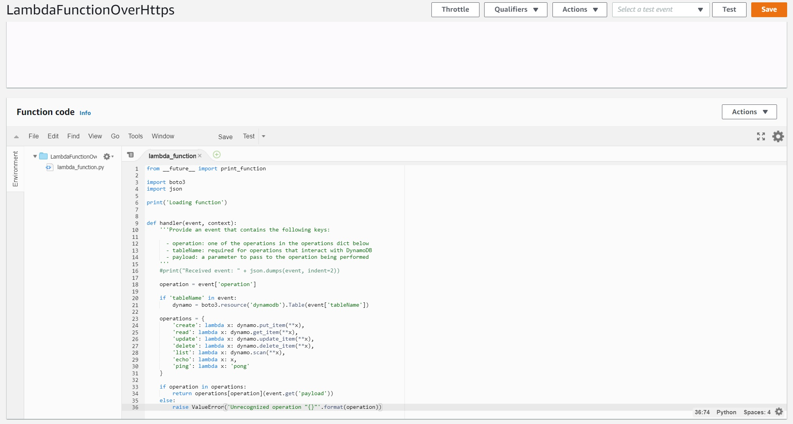
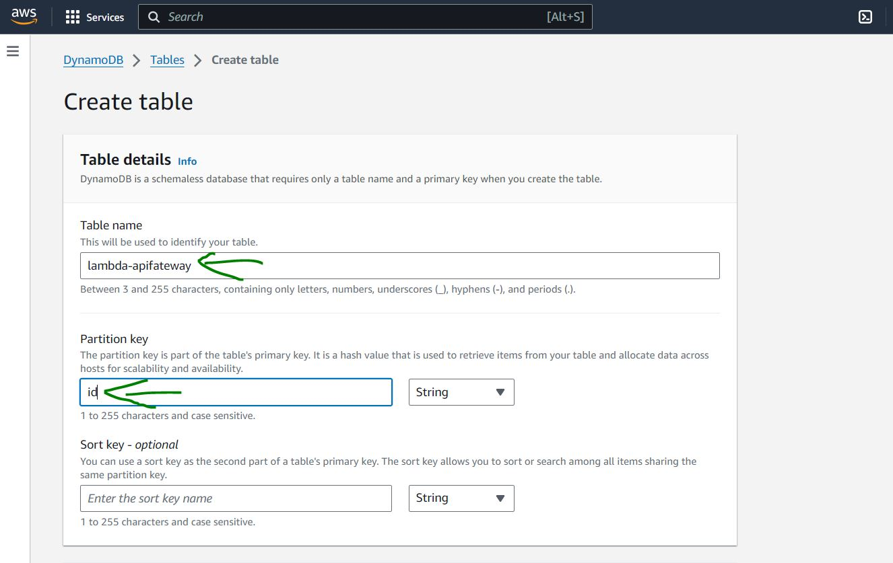
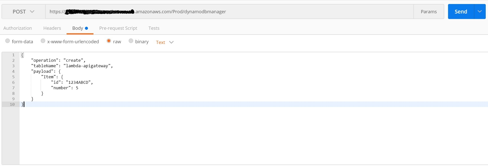

# LevelUp! Lab for Serverless

## Lab Overview And High Level Design

Let's start with the High Level Design.

An Amazon API Gateway is a collection of resources and methods. For this tutorial, you create one resource (DynamoDBManager) and define one method (POST) on it. The method is backed by a Lambda function (LambdaFunctionOverHttps). That is, when you call the API through an HTTPS endpoint, Amazon API Gateway invokes the Lambda function.

The POST method on the DynamoDBManager resource supports the following DynamoDB operations:

* Create, update, and delete an item.
* Read an item.
* Scan an item.
* Other operations (echo, ping), not related to DynamoDB, that you can use for testing.

The request payload you send in the POST request identifies the DynamoDB operation and provides necessary data. For example:

The following is a sample request payload for a DynamoDB create item operation:

```json
{
    "operation": "create",
    "tableName": "lambda-apigateway",
    "payload": {
        "Item": {
            "id": "1",
            "name": "Bob"
        }
    }
}
```
The following is a sample request payload for a DynamoDB read item operation:
```json
{
    "operation": "read",
    "tableName": "lambda-apigateway",
    "payload": {
        "Key": {
            "id": "1"
        }
    }
}
```

## Setup

### Create Lambda IAM Role 
Create the execution role that gives your function permission to access AWS resources.

To create an execution role

1. Open the roles page in the IAM console.
2. Choose Create role.
3. Create a role with the following properties.
    * Trusted entity – Lambda.
    * Role name – **lambda-apigateway-role**.
    * Permissions – Custom policy with permission to DynamoDB and CloudWatch Logs. This custom policy has the permissions that  the function needs to write data to DynamoDB and upload logs. 
    ```json
    {
    "Version": "2012-10-17",
    "Statement": [
    {
      "Sid": "Stmt1428341300017",
      "Action": [
        "dynamodb:DeleteItem",
        "dynamodb:GetItem",
        "dynamodb:PutItem",
        "dynamodb:Query",
        "dynamodb:Scan",
        "dynamodb:UpdateItem"
      ],
      "Effect": "Allow",
      "Resource": "*"
    },
    {
      "Sid": "",
      "Resource": "*",
      "Action": [
        "logs:CreateLogGroup",
        "logs:CreateLogStream",
        "logs:PutLogEvents"
      ],
      "Effect": "Allow"
    }
    ]
    }
    ```

### Create Lambda Function

**To create the function**
1. Click "Create function" in AWS Lambda Console


2. Select "Author from scratch". Use name **LambdaFunctionOverHttps** , select **Python 3.7** as Runtime. Under Permissions, select "Use an existing role", and select **lambda-apigateway-role** that we created, from the drop down

3. Click "Create function"


4. Replace the boilerplate coding with the following code snippet and click "Save"

**Example Python Code**
```python
from __future__ import print_function

import boto3
import json

print('Loading function')


def lambda_handler(event, context):
    '''Provide an event that contains the following keys:

      - operation: one of the operations in the operations dict below
      - tableName: required for operations that interact with DynamoDB
      - payload: a parameter to pass to the operation being performed
    '''
    #print("Received event: " + json.dumps(event, indent=2))

    operation = event['operation']

    if 'tableName' in event:
        dynamo = boto3.resource('dynamodb').Table(event['tableName'])

    operations = {
        'create': lambda x: dynamo.put_item(**x),
        'read': lambda x: dynamo.get_item(**x),
        'update': lambda x: dynamo.update_item(**x),
        'delete': lambda x: dynamo.delete_item(**x),
        'list': lambda x: dynamo.scan(**x),
        'echo': lambda x: x,
        'ping': lambda x: 'pong'
    }

    if operation in operations:
        return operations[operation](event.get('payload'))
    else:
        raise ValueError('Unrecognized operation "{}"'.format(operation))
```


### Test Lambda Function

Let's test our newly created function. We haven't created DynamoDB and the API yet, so we'll do a sample echo operation. The function should output whatever input we pass.
1. Click the arrow on "Select a test event" and click "Configure test events"


2. Paste the following JSON into the event. The field "operation" dictates what the lambda function will perform. In this case, it'd simply return the payload from input event as output. Click "Create" to save
```json
{
    "operation": "echo",
    "payload": {
        "somekey1": "somevalue1",
        "somekey2": "somevalue2"
    }
}
```


3. Click "Test", and it will execute the test event. You should see the output in the console


We're all set to create DynamoDB table and an API using our lambda as backend!

### Create DynamoDB Table

Create the DynamoDB table that the Lambda function uses.

**To create a DynamoDB table**

1. Open the DynamoDB console.
2. Choose Create table.
3. Create a table with the following settings.
   * Table name – lambda-apigateway
   * Primary key – id (string)
4. Choose Create.




### Create API

**To create the API**
1. Go to API Gateway console
2. Click Create API

 

3. Scroll down and select "Build" for REST API

 


5. Give the API name as "DynamoDBOperations", keep everything as is, click "Create API"


5. Each API is collection of resources and methods that are integrated with backend HTTP endpoints, Lambda functions, or other AWS services. Typically, API resources are organized in a resource tree according to the application logic. At this time you only have the root resource, but let's add a resource next 

Click "Actions", then click "Create Resource"


6. Input "DynamoDBManager" in the Resource Name, Resource Path will get populated. Click "Create Resource"


7. Let's create a POST Method for our API. With the "/dynamodbmanager" resource selected, Click "Actions" again and click "Create Method". 


8. Select "POST" from drop down , then click checkmark


9. The integration will come up automatically with "Lambda Function" option selected. Select "LambdaFunctionOverHttps" function that we created earlier. As you start typing the name, your function name will show up.Select and click "Save". A popup window will come up to add resource policy to the lambda to be invoked by this API. Click "Ok"


Our API-Lambda integration is done!

### Deploy the API

In this step, you deploy the API that you created to a stage called prod.

1. Click "Actions", select "Deploy API"


2. Now it is going to ask you about a stage. Select "[New Stage]" for "Deployment stage". Give "Prod" as "Stage name". Click "Deploy"


3. We're all set to run our solution! To invoke our API endpoint, we need the endpoint url. In the "Stages" screen, expand the stage "Prod", select "POST" method, and copy the "Invoke URL" from screen


### Running our solution

1. The Lambda function supports using the create operation to create an item in your DynamoDB table. To request this operation, use the following JSON:

```json
{
    "operation": "create",
    "tableName": "lambda-apigateway",
    "payload": {
        "Item": {
            "id": "1234ABCD",
            "number": 5
        }
    }
}
```
2. To execute our API from local machine, we are going to use Postman and Curl command. You can choose either method based on your convenience and familiarity. 
    * To run this from Postman, select "POST" , paste the API invoke url. Then under "Body" select "raw" and paste the above JSON. Click "Send". API should execute and return "HTTPStatusCode" 200.

    

    * To run this from terminal using Curl, run the below
    ```
    $ curl -X POST -d "{\"operation\":\"create\",\"tableName\":\"lambda-apigateway\",\"payload\":{\"Item\":{\"id\":\"1\",\"name\":\"Bob\"}}}" https://$API.execute-api.$REGION.amazonaws.com/prod/DynamoDBManager
    ```   
3. To validate that the item is indeed inserted into DynamoDB table, go to Dynamo console, select "lambda-apigateway" table, select "Items" tab, and the newly inserted item should be displayed.


4. To get all the inserted items from the table, we can use the "list" operation of Lambda using the same API. Pass the following JSON to the API, and it will return all the items from the Dynamo table

```json
{
    "operation": "list",
    "tableName": "lambda-apigateway",
    "payload": {
    }
}
```


We have successfully created a serverless API using API Gateway, Lambda, and DynamoDB!

## Performance test using Postman

Install native desktop version postman tool and sign in to an account.

Create new collection and post method like below 


List operation below 


Run collection in performance test mode


Sample report for the performance test done


## To DO or To BE:

The AWS Serverless Application Model (AWS SAM) is a toolkit that improves the developer experience of building and running serverless applications on AWS. 
AWS SAM template specification – An open-source framework that you can use to define your serverless application infrastructure on AWS.
Sample SAM template as below
AWSTemplateFormatVersion: '2010-09-09'
Transform: 'AWS::Serverless-2016-10-31'

Description: SAM template for API Gateway, Lambda, and DynamoDB CRUD project architecture

```
Resources:
  DynamoDBTable:
    Type: 'AWS::DynamoDB::Table'
    Properties:
      TableName: lambda-apigateway
      AttributeDefinitions:
        - AttributeName: id
          AttributeType: S
      KeySchema:
        - AttributeName: id
          KeyType: HASH
      ProvisionedThroughput:
        ReadCapacityUnits: 5
        WriteCapacityUnits: 5

  LambdaFunction:
    Type: 'AWS::Serverless::Function'
    Properties:
      Handler: lambda_function.lambda_handler
      Runtime: python3.8
      Policies:
        - DynamoDBCrudPolicy: {}
      Environment:
        Variables:
          TABLE_NAME: !Ref DynamoDBTable
      Events:
        ApiGatewayEvent:
          Type: Api
          Properties:
            Path: /dynamodbmanager
            Method: post

Outputs:
  ApiUrl:
    Description: URL of the API Gateway endpoint
    Value: !Sub 'https://${ServerlessRestApi}.execute-api.${AWS::Region}.amazonaws.com/Prod/dynamodbmanager'
  DynamoDBTableName:
    Description: Name of the DynamoDB table
    Value: !Ref DynamoDBTable
```
1. sam deploy --guided --template template.yaml is the command you enter at the command line.
2. sam deploy --guided --template should be provided as is.
3. template.yaml can be replaced with your specific file name.
4. The output starts at Configuring SAM deploy.
5. In the output, ENTER and y indicate replaceable values that you provide.


## Cleanup

Let's clean up the resources we have created for this lab.


### Cleaning up DynamoDB

To delete the table, from DynamoDB console, select the table "lambda-apigateway", and click "Delete table"


To delete the Lambda, from the Lambda console, select lambda "LambdaFunctionOverHttps", click "Actions", then click Delete 


To delete the API we created, in API gateway console, under APIs, select "DynamoDBOperations" API, click "Actions", then "Delete"


